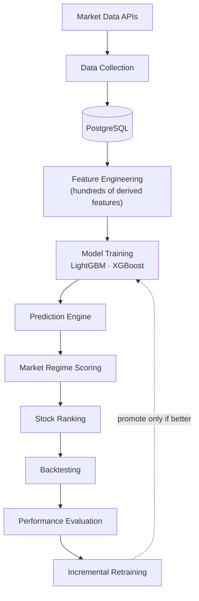
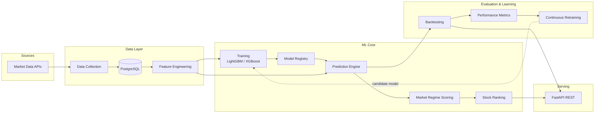
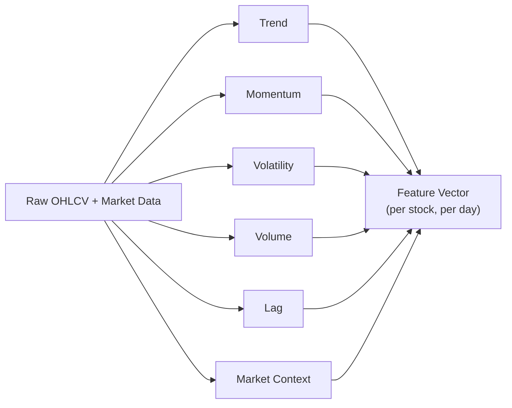
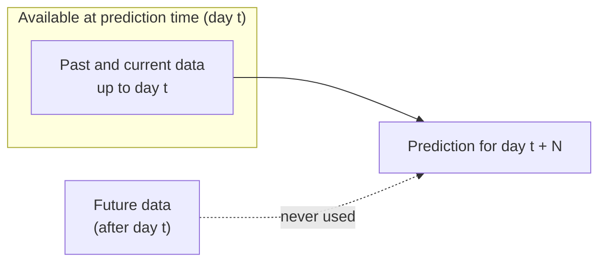
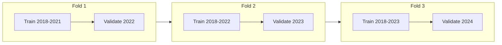
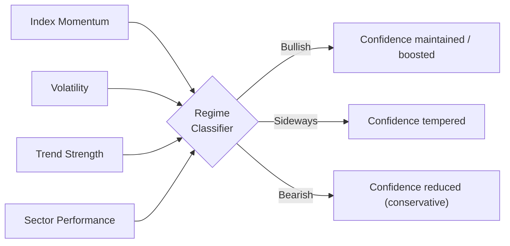
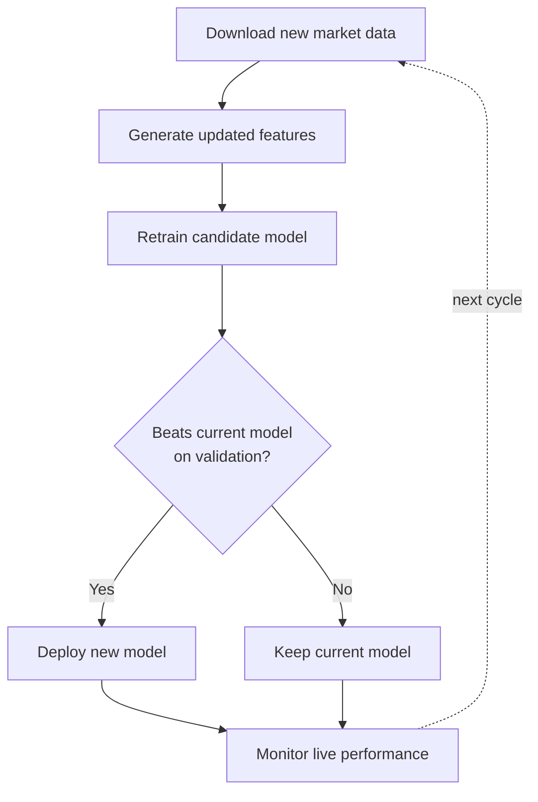
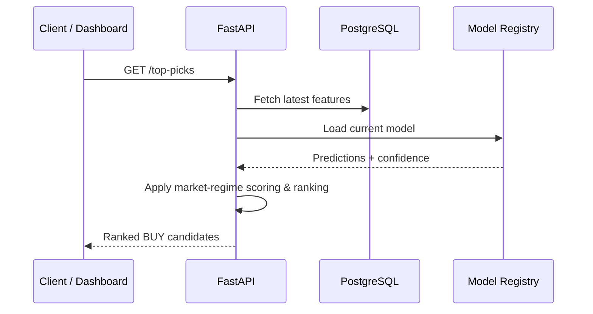

# 📈 AI-Powered Quantitative Stock Analysis Platform

> An end-to-end machine-learning pipeline that screens the market for **high-probability BUY opportunities** — from data ingestion and feature engineering to model training, backtesting, and continuous retraining — served through a FastAPI backend.


This platform automatically analyzes historical market data, predicts potential trading opportunities,
and **continuously improves its models** as new market data arrives. Rather than executing trades, its
purpose is to help investors **identify** high-probability BUY candidates using data-driven, time-aware
machine learning — with rigorous safeguards against the pitfalls (data leakage, overfitting, regime
shift) that make naïve financial ML look great in testing and fail in production.

> ⚠️ **Disclaimer:** For research and educational purposes only — **not financial advice**. It does not place trades, and past results do not guarantee future performance.

---

## Table of Contents

- [Why This Project](#why-this-project)
- [Machine Learning Pipeline](#machine-learning-pipeline)
- [System Architecture](#system-architecture)
- [1. Data Ingestion](#1-data-ingestion)
- [2. Feature Engineering](#2-feature-engineering)
- [3. Preventing Time-Series Data Leakage](#3-preventing-time-series-data-leakage)
- [4. Model Training](#4-model-training)
- [5. Prediction Engine](#5-prediction-engine)
- [6. Market Regime Scoring](#6-market-regime-scoring)
- [7. Backtesting](#7-backtesting)
- [8. Continuous Retraining](#8-continuous-retraining)
- [9. FastAPI Backend](#9-fastapi-backend)
- [10. Performance Optimization](#10-performance-optimization)
- [Technology Stack](#technology-stack)
- [Key Technical Highlights](#key-technical-highlights)

---

## Why This Project

Most "stock prediction" demos quietly cheat: they shuffle time-ordered data, leak future information into
features, and report accuracy numbers that evaporate in live markets. This platform is built as a
**production-grade, end-to-end ML system** that treats those problems as first-class concerns:

- **Time-aware everything** — chronological processing, walk-forward validation, no look-ahead.
- **Screening, not gambling** — outputs ranked probabilities and confidence, not blind auto-trades.
- **Self-improving** — retrains on new data and only promotes a model that *proves* it is better.
- **Honest evaluation** — every strategy is backtested with risk-adjusted metrics before it is trusted.

---

## Machine Learning Pipeline

The entire workflow is automated — no manual downloading of prices or ad-hoc strategy testing.



---

## System Architecture

Independent services cooperate as a complete ML pipeline, each responsible for one stage and
communicating through PostgreSQL and a model registry.



---

## 1. Data Ingestion

The system periodically downloads market data and stores it in **PostgreSQL** for downstream processing:

- **Daily OHLC prices** — Open, High, Low, Close
- **Trading volume**
- **Dividend adjustments** & **corporate actions**
- **Market index data**
- **Sector information**

**Example (raw daily bars):**

| Symbol | Date  | Open | High | Low | Close | Volume |
| ------ | ----- | ---- | ---- | --- | ----- | ------ |
| AAPL   | Jan 1 | 195  | 198  | 193 | 197   | 42M    |
| AAPL   | Jan 2 | 197  | 199  | 196 | 198   | 39M    |

---

## 2. Feature Engineering

Raw prices alone are weak predictors, so the platform derives **hundreds of features** across six
families. Every feature is computed **strictly from past-and-current data** (see [leakage](#3-preventing-time-series-data-leakage)).

| Family | Example Features | What It Captures |
| ------ | ---------------- | ---------------- |
| **Trend** | SMA (20/50/200), EMA, MACD | Direction and trend-following crossovers |
| **Momentum** | RSI, ROC, Momentum | How fast prices move; overbought / oversold |
| **Volatility** | ATR, Bollinger Bands, Historical Volatility | Market uncertainty and risk sizing |
| **Volume** | Average Volume, Volume Ratio, On-Balance Volume | Whether price moves are backed by participation |
| **Lag** | Close (t−1, t−2, t−5), last-week return | Short-term temporal dependencies |
| **Market Context** | Index performance, sector strength, relative performance, sentiment | Cross-sectional and macro context |



---

## 3. Preventing Time-Series Data Leakage

The single biggest failure mode in financial ML is **data leakage** — letting future information bleed
into training. A model that (even accidentally) sees *tomorrow's* close while predicting *today* will
score beautifully in tests and collapse in live trading.

The platform enforces strict temporal discipline:

- Data is processed in **chronological order**.
- Feature calculations **never** reference future values.
- Train / validation splits **always respect the time sequence** (no shuffling).



---

## 4. Model Training

The platform trains **gradient boosting** models — **LightGBM** and **XGBoost** — which learn patterns
from historical behavior instead of relying on fixed, hand-coded trading rules.

**Prediction target** — a binary label answering:

> *Will this stock generate a profitable BUY signal within **N** days?*

```
BUY     = 1
NOT BUY = 0
```

### Walk-Forward Validation (TimeSeriesSplit)

Instead of random splits, training always occurs on **earlier** data and validation on **later** periods,
using an expanding window that mirrors real trading conditions.



### Additional Training Safeguards

- **Early stopping** — training halts once validation performance plateaus → faster training, better
  generalization, less overfitting.
- **Class imbalance handling** — profitable BUY windows are rare, so the platform applies **class
  weighting / adjusted sampling** so the model attends to these scarce positive examples without
  overfitting to them.

---

## 5. Prediction Engine

Once trained, the model scores the latest market data **every trading day**. For each stock it outputs a
**BUY probability**, a **confidence score**, and a **risk level**, then ranks the universe by confidence.

**Example — ranked BUY candidates:**

| Rank | Symbol | BUY Probability |
| ---- | ------ | --------------- |
| 1    | AAPL   | 91%             |
| 2    | NVDA   | 88%             |
| 3    | AMD    | 79%             |
| —    | TSLA   | 35%             |

---

## 6. Market Regime Scoring

A strategy that thrives in a bull market can bleed during high volatility or a downtrend. The platform
continuously evaluates the market environment — **index momentum, volatility, trend strength, sector
performance** — classifies the regime (**bullish / bearish / sideways**), and **adjusts prediction
confidence** accordingly, producing more conservative recommendations in uncertain conditions.



---

## 7. Backtesting

Before predictions are trusted, the platform **simulates historical trades** — stepping through time,
running predictions as if live, executing simulated trades, and measuring outcomes.

**Evaluation metrics:**

| Metric | Meaning |
| ------ | ------- |
| **Total Return** | Overall profit/loss of the simulated strategy |
| **Win Rate** | Share of trades that were profitable |
| **Maximum Drawdown** | Largest peak-to-trough equity decline (downside risk) |
| **Sharpe Ratio** | Return per unit of risk (risk-adjusted performance) |
| **Precision** | Of predicted BUYs, how many were actually profitable |
| **Recall** | Of all real opportunities, how many the model captured |
| **Profit Factor** | Gross profit ÷ gross loss |

This provides an **objective** view of how the strategy would have performed historically.

---

## 8. Continuous Retraining

Markets evolve, so models must adapt. On a schedule, the platform retrains a **candidate** model and
promotes it **only if it beats the incumbent** on validation — preventing silent performance decay.



---

## 9. FastAPI Backend

The platform exposes its capabilities through a **REST API**, letting dashboards, web apps, or external
services request predictions and trigger training/evaluation jobs.

| Method | Endpoint | Description |
| ------ | -------- | ----------- |
| `GET`  | `/stocks` | List tracked stocks |
| `GET`  | `/prediction/{symbol}` | Latest prediction for a symbol |
| `GET`  | `/top-picks` | Ranked, highest-confidence BUY candidates |
| `POST` | `/train` | Trigger a model training run |
| `POST` | `/backtest` | Run a historical backtest |

**Request flow for `GET /top-picks`:**



---

## 10. Performance Optimization

To screen thousands of stocks efficiently, the platform applies several optimizations:

- **Asynchronous workflows** — parallelize data collection and inference.
- **Vectorized computation** — Pandas / NumPy for fast feature generation.
- **Batch prediction** — efficient inference across the full universe.
- **Feature caching** — avoid recomputing unchanged intermediate features.
- **Docker-based deployment** — consistent, reproducible execution across environments.

---

## Technology Stack

| Layer | Technologies |
| ----- | ------------ |
| **Language** | Python |
| **Machine Learning** | LightGBM, XGBoost, scikit-learn (TimeSeriesSplit, early stopping) |
| **Data Processing** | Pandas, NumPy (vectorized feature engineering) |
| **Storage** | PostgreSQL |
| **API / Serving** | FastAPI (REST) |
| **Concurrency** | asyncio (asynchronous collection & inference) |
| **Deployment** | Docker |

---

## Key Technical Highlights

This project demonstrates **end-to-end machine-learning engineering**, not just model building:

- 🧩 **Robust time-series pipeline** — chronological processing with strict leakage prevention
- 🛠️ **Rich feature engineering** — hundreds of trend, momentum, volatility, volume, lag & context features
- 🌲 **Gradient boosting** — LightGBM & XGBoost with class-imbalance handling and early stopping
- ⏳ **Time-aware validation** — walk-forward `TimeSeriesSplit` instead of naïve random splits
- 🧪 **Rigorous backtesting** — risk-adjusted metrics (Sharpe, drawdown, profit factor) before trust
- 🌦️ **Market-regime awareness** — confidence adapts to bullish / bearish / sideways conditions
- 🔁 **Automated retraining** — promote-only-if-better guards against performance decay
- ⚡ **Scalable, API-driven serving** — async, vectorized, batched, cached, and Dockerized

The result is a **production-ready quantitative analysis platform** that continuously screens stocks,
adapts to changing market conditions, and delivers data-driven investment insights through a modular,
API-driven architecture.
